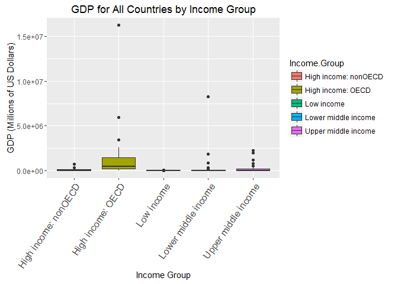

# DSCaseStudy-1
Rajni Goyal  
October 28, 2016  


# Introduction

####Our partners at "The World Bank" have captured and provided us with GDP Ranking and Education statistics of countries across the world.Both are independent data sets providing different types of data for more or less the same countries (How closely these data sets match up will be discussed further in this study). Although we have been provided the data from "The World Bank", there are several steps needed to be taken to tidy up the data before analysis can begin on the data. To ensure that the data is used in the most productive and meaningful manner that can increase the intrinsic value the special importance have been given to data quality. In the below sections, we will walk through loading and cleaning the datasets provided to us. Once we are sure that the data is tidy enough, we will dive into our analysis and answer 5 core questions.

____________________________________________

##Questions to be Analyzed

#### 1. Match the data based on the country shortcode. How many of the IDs match?
#### 2. Sort the data frame in ascending order by GDP (so United States is last). What is the 13th country in the          resulting data frame?
#### 3. What are the average GDP rankings for the "High income: OECD" and "High income: nonOECD" groups?
#### 4. Plot the GDP for all of the countries. Use ggplot2 to color your plot by Income.Group.
#### 5. Cut the GDP ranking into 5 separate quantile groups. Make a table versus Income.Group. How many countries are      lower middle income but among the 38 nations with the highest GDP?

<br>

## Required Libraries

#### The "downloader", "dplyr"", "ggplot2"", and "knitr"" libraries are required to carry out this study.If any of these packages have not been installed, install.packages lines below needs to be uncommented before knitting this file.

    #install.packages("downloader")
    #install.packages("knitr")
    #install.packages("ggplot2")
    #install.packages("dplyr")

    library(downloader)
    library(ggplot2)
    library(dplyr)
    library(knitr)


# Methods

____________________________________________________________

### GDP Data: Download and tidy up the data


```
## 
## > library(downloader)
## 
## > library(dplyr)
## 
## > library(ggplot2)
## 
## > library(knitr)
## 
## > GDPURL <- "https://d396qusza40orc.cloudfront.net/getdata%2Fdata%2FGDP.csv"
## 
## > download(GDPURL, destfile = "GrossDomesticProduct.csv")
## 
## > list.files()
## [1] "Analysis"                   "Case-Study+1.pdf"          
## [3] "DSCaseStudy-1.html"         "DSCaseStudy-1.md"          
## [5] "DSCaseStudy-1.Rmd"          "DSCaseStudy-1_files"       
## [7] "DSCaseStudy-1Project.Rproj" "Education.csv"             
## [9] "GrossDomesticProduct.csv"  
## 
## > GDPRaw <- read.csv("GrossDomesticProduct.csv", stringsAsFactors = FALSE, 
## +     header = FALSE)
## 
## > str(GDPRaw)
## 'data.frame':	331 obs. of  10 variables:
##  $ V1 : chr  "" "" "" "" ...
##  $ V2 : chr  "Gross domestic product 2012" "" "" "Ranking" ...
##  $ V3 : logi  NA NA NA NA NA NA ...
##  $ V4 : chr  "" "" "" "Economy" ...
##  $ V5 : chr  "" "" "(millions of" "US dollars)" ...
##  $ V6 : chr  "" "" "" "" ...
##  $ V7 : logi  NA NA NA NA NA NA ...
##  $ V8 : logi  NA NA NA NA NA NA ...
##  $ V9 : logi  NA NA NA NA NA NA ...
##  $ V10: logi  NA NA NA NA NA NA ...
## 
## > head(GDPRaw)
##    V1                          V2 V3            V4           V5 V6 V7 V8
## 1     Gross domestic product 2012 NA                               NA NA
## 2                                 NA                               NA NA
## 3                                 NA               (millions of    NA NA
## 4                         Ranking NA       Economy  US dollars)    NA NA
## 5                                 NA                               NA NA
## 6 USA                           1 NA United States  16,244,600     NA NA
##   V9 V10
## 1 NA  NA
## 2 NA  NA
## 3 NA  NA
## 4 NA  NA
## 5 NA  NA
## 6 NA  NA
## 
## > kable(tail(GDPRaw, 100))
## 
## 
##       V1    V2                                                                                                                             V3   V4                           V5           V6   V7   V8   V9   V10 
## ----  ----  -----------------------------------------------------------------------------------------------------------------------------  ---  ---------------------------  -----------  ---  ---  ---  ---  ----
## 232   MNA                                                                                                                                  NA   Middle East & North Africa   1,540,807         NA   NA   NA   NA  
## 233   SAS                                                                                                                                  NA   South Asia                   2,286,093         NA   NA   NA   NA  
## 234   SSA                                                                                                                                  NA   Sub-Saharan Africa           1,289,813         NA   NA   NA   NA  
## 235   HIC                                                                                                                                  NA   High income                  49,717,634        NA   NA   NA   NA  
## 236   EMU                                                                                                                                  NA   Euro area                    12,192,344        NA   NA   NA   NA  
## 237                                                                                                                                        NA                                                  NA   NA   NA   NA  
## 238         .. Not available.                                                                                                              NA                                                  NA   NA   NA   NA  
## 239         Note: Rankings include only those economies with confirmed GDP estimates. Figures in italics are for 2011 or 2010.             NA                                                  NA   NA   NA   NA  
## 240         a. Includes Former Spanish Sahara.  b. Excludes South Sudan  c. Covers mainland Tanzania only. d. Data are for the area        NA                                                  NA   NA   NA   NA  
## 241         controlled by the government of the Republic of Cyprus.   e. Excludes Abkhazia and South Ossetia.  f. Excludes Transnistria.   NA                                                  NA   NA   NA   NA  
## 242                                                                                                                                        NA                                                  NA   NA   NA   NA  
## 243                                                                                                                                        NA                                                  NA   NA   NA   NA  
## 244                                                                                                                                        NA                                                  NA   NA   NA   NA  
## 245                                                                                                                                        NA                                                  NA   NA   NA   NA  
## 246                                                                                                                                        NA                                                  NA   NA   NA   NA  
## 247                                                                                                                                        NA                                                  NA   NA   NA   NA  
## 248                                                                                                                                        NA                                                  NA   NA   NA   NA  
## 249                                                                                                                                        NA                                                  NA   NA   NA   NA  
## 250                                                                                                                                        NA                                                  NA   NA   NA   NA  
## 251                                                                                                                                        NA                                                  NA   NA   NA   NA  
## 252                                                                                                                                        NA                                                  NA   NA   NA   NA  
## 253                                                                                                                                        NA                                                  NA   NA   NA   NA  
## 254                                                                                                                                        NA                                                  NA   NA   NA   NA  
## 255                                                                                                                                        NA                                                  NA   NA   NA   NA  
## 256                                                                                                                                        NA                                                  NA   NA   NA   NA  
## 257                                                                                                                                        NA                                                  NA   NA   NA   NA  
## 258                                                                                                                                        NA                                                  NA   NA   NA   NA  
## 259                                                                                                                                        NA                                                  NA   NA   NA   NA  
## 260                                                                                                                                        NA                                                  NA   NA   NA   NA  
## 261                                                                                                                                        NA                                                  NA   NA   NA   NA  
## 262                                                                                                                                        NA                                                  NA   NA   NA   NA  
## 263                                                                                                                                        NA                                                  NA   NA   NA   NA  
## 264                                                                                                                                        NA                                                  NA   NA   NA   NA  
## 265                                                                                                                                        NA                                                  NA   NA   NA   NA  
## 266                                                                                                                                        NA                                                  NA   NA   NA   NA  
## 267                                                                                                                                        NA                                                  NA   NA   NA   NA  
## 268                                                                                                                                        NA                                                  NA   NA   NA   NA  
## 269                                                                                                                                        NA                                                  NA   NA   NA   NA  
## 270                                                                                                                                        NA                                                  NA   NA   NA   NA  
## 271                                                                                                                                        NA                                                  NA   NA   NA   NA  
## 272                                                                                                                                        NA                                                  NA   NA   NA   NA  
## 273                                                                                                                                        NA                                                  NA   NA   NA   NA  
## 274                                                                                                                                        NA                                                  NA   NA   NA   NA  
## 275                                                                                                                                        NA                                                  NA   NA   NA   NA  
## 276                                                                                                                                        NA                                                  NA   NA   NA   NA  
## 277                                                                                                                                        NA                                                  NA   NA   NA   NA  
## 278                                                                                                                                        NA                                                  NA   NA   NA   NA  
## 279                                                                                                                                        NA                                                  NA   NA   NA   NA  
## 280                                                                                                                                        NA                                                  NA   NA   NA   NA  
## 281                                                                                                                                        NA                                                  NA   NA   NA   NA  
## 282                                                                                                                                        NA                                                  NA   NA   NA   NA  
## 283                                                                                                                                        NA                                                  NA   NA   NA   NA  
## 284                                                                                                                                        NA                                                  NA   NA   NA   NA  
## 285                                                                                                                                        NA                                                  NA   NA   NA   NA  
## 286                                                                                                                                        NA                                                  NA   NA   NA   NA  
## 287                                                                                                                                        NA                                                  NA   NA   NA   NA  
## 288                                                                                                                                        NA                                                  NA   NA   NA   NA  
## 289                                                                                                                                        NA                                                  NA   NA   NA   NA  
## 290                                                                                                                                        NA                                                  NA   NA   NA   NA  
## 291                                                                                                                                        NA                                                  NA   NA   NA   NA  
## 292                                                                                                                                        NA                                                  NA   NA   NA   NA  
## 293                                                                                                                                        NA                                                  NA   NA   NA   NA  
## 294                                                                                                                                        NA                                                  NA   NA   NA   NA  
## 295                                                                                                                                        NA                                                  NA   NA   NA   NA  
## 296                                                                                                                                        NA                                                  NA   NA   NA   NA  
## 297                                                                                                                                        NA                                                  NA   NA   NA   NA  
## 298                                                                                                                                        NA                                                  NA   NA   NA   NA  
## 299                                                                                                                                        NA                                                  NA   NA   NA   NA  
## 300                                                                                                                                        NA                                                  NA   NA   NA   NA  
## 301                                                                                                                                        NA                                                  NA   NA   NA   NA  
## 302                                                                                                                                        NA                                                  NA   NA   NA   NA  
## 303                                                                                                                                        NA                                                  NA   NA   NA   NA  
## 304                                                                                                                                        NA                                                  NA   NA   NA   NA  
## 305                                                                                                                                        NA                                                  NA   NA   NA   NA  
## 306                                                                                                                                        NA                                                  NA   NA   NA   NA  
## 307                                                                                                                                        NA                                                  NA   NA   NA   NA  
## 308                                                                                                                                        NA                                                  NA   NA   NA   NA  
## 309                                                                                                                                        NA                                                  NA   NA   NA   NA  
## 310                                                                                                                                        NA                                                  NA   NA   NA   NA  
## 311                                                                                                                                        NA                                                  NA   NA   NA   NA  
## 312                                                                                                                                        NA                                                  NA   NA   NA   NA  
## 313                                                                                                                                        NA                                                  NA   NA   NA   NA  
## 314                                                                                                                                        NA                                                  NA   NA   NA   NA  
## 315                                                                                                                                        NA                                                  NA   NA   NA   NA  
## 316                                                                                                                                        NA                                                  NA   NA   NA   NA  
## 317                                                                                                                                        NA                                                  NA   NA   NA   NA  
## 318                                                                                                                                        NA                                                  NA   NA   NA   NA  
## 319                                                                                                                                        NA                                                  NA   NA   NA   NA  
## 320                                                                                                                                        NA                                                  NA   NA   NA   NA  
## 321                                                                                                                                        NA                                                  NA   NA   NA   NA  
## 322                                                                                                                                        NA                                                  NA   NA   NA   NA  
## 323                                                                                                                                        NA                                                  NA   NA   NA   NA  
## 324                                                                                                                                        NA                                                  NA   NA   NA   NA  
## 325                                                                                                                                        NA                                                  NA   NA   NA   NA  
## 326                                                                                                                                        NA                                                  NA   NA   NA   NA  
## 327                                                                                                                                        NA                                                  NA   NA   NA   NA  
## 328                                                                                                                                        NA                                                  NA   NA   NA   NA  
## 329                                                                                                                                        NA                                                  NA   NA   NA   NA  
## 330                                                                                                                                        NA                                                  NA   NA   NA   NA  
## 331                                                                                                                                        NA                                                  NA   NA   NA   NA  
## 
## > GDP <- GDPRaw[6:236, ]
## 
## > str(GDP)
## 'data.frame':	231 obs. of  10 variables:
##  $ V1 : chr  "USA" "CHN" "JPN" "DEU" ...
##  $ V2 : chr  "1" "2" "3" "4" ...
##  $ V3 : logi  NA NA NA NA NA NA ...
##  $ V4 : chr  "United States" "China" "Japan" "Germany" ...
##  $ V5 : chr  " 16,244,600 " " 8,227,103 " " 5,959,718 " " 3,428,131 " ...
##  $ V6 : chr  "" "" "" "" ...
##  $ V7 : logi  NA NA NA NA NA NA ...
##  $ V8 : logi  NA NA NA NA NA NA ...
##  $ V9 : logi  NA NA NA NA NA NA ...
##  $ V10: logi  NA NA NA NA NA NA ...
## 
## > head(GDP)
##     V1 V2 V3             V4           V5 V6 V7 V8 V9 V10
## 6  USA  1 NA  United States  16,244,600     NA NA NA  NA
## 7  CHN  2 NA          China   8,227,103     NA NA NA  NA
## 8  JPN  3 NA          Japan   5,959,718     NA NA NA  NA
## 9  DEU  4 NA        Germany   3,428,131     NA NA NA  NA
## 10 FRA  5 NA         France   2,612,878     NA NA NA  NA
## 11 GBR  6 NA United Kingdom   2,471,784     NA NA NA  NA
## 
## > tail(GDP)
##      V1 V2 V3                           V4         V5 V6 V7 V8 V9 V10
## 231 LAC    NA    Latin America & Caribbean  5,344,028    NA NA NA  NA
## 232 MNA    NA   Middle East & North Africa  1,540,807    NA NA NA  NA
## 233 SAS    NA                   South Asia  2,286,093    NA NA NA  NA
## 234 SSA    NA           Sub-Saharan Africa  1,289,813    NA NA NA  NA
## 235 HIC    NA                  High income 49,717,634    NA NA NA  NA
## 236 EMU    NA                    Euro area 12,192,344    NA NA NA  NA
## 
## > sum(!is.na(GDP[, c(3, 7:10)]))
## [1] 0
## 
## > sum(GDP$V2 != "")
## [1] 190
## 
## > sum(GDP$V2 == "")
## [1] 41
## 
## > sum(GDP$V6 != "")
## [1] 6
## 
## > sum(GDP$V6 == "")
## [1] 225
## 
## > GDP <- GDP[, c(1, 2, 4:6)]
## 
## > str(GDP)
## 'data.frame':	231 obs. of  5 variables:
##  $ V1: chr  "USA" "CHN" "JPN" "DEU" ...
##  $ V2: chr  "1" "2" "3" "4" ...
##  $ V4: chr  "United States" "China" "Japan" "Germany" ...
##  $ V5: chr  " 16,244,600 " " 8,227,103 " " 5,959,718 " " 3,428,131 " ...
##  $ V6: chr  "" "" "" "" ...
## 
## > head(GDP)
##     V1 V2             V4           V5 V6
## 6  USA  1  United States  16,244,600    
## 7  CHN  2          China   8,227,103    
## 8  JPN  3          Japan   5,959,718    
## 9  DEU  4        Germany   3,428,131    
## 10 FRA  5         France   2,612,878    
## 11 GBR  6 United Kingdom   2,471,784    
## 
## > tail(GDP)
##      V1 V2                           V4         V5 V6
## 231 LAC       Latin America & Caribbean  5,344,028   
## 232 MNA      Middle East & North Africa  1,540,807   
## 233 SAS                      South Asia  2,286,093   
## 234 SSA              Sub-Saharan Africa  1,289,813   
## 235 HIC                     High income 49,717,634   
## 236 EMU                       Euro area 12,192,344   
## 
## > names(GDP) <- c("Country.ShortCode", "Country.Rank", 
## +     "Economy", "GDP.Millions.of.US.Dollars", "Comments")
## 
## > names(GDP)
## [1] "Country.ShortCode"          "Country.Rank"              
## [3] "Economy"                    "GDP.Millions.of.US.Dollars"
## [5] "Comments"                  
## 
## > GDP[GDP$Comments != "", ]
##     Country.ShortCode Country.Rank  Economy GDP.Millions.of.US.Dollars
## 67                MAR           62  Morocco                    95,982 
## 78                SDN           73    Sudan                    58,769 
## 100               TZA           95 Tanzania                    28,242 
## 107               CYP          102   Cyprus                    22,767 
## 119               GEO          114  Georgia                    15,747 
## 146               MDA          141  Moldova                     7,253 
##     Comments
## 67         a
## 78         b
## 100        c
## 107        d
## 119        e
## 146        f
## 
## > GDP$Comments[GDP$Comments == "a"] <- "Includes Former Spanish Sahara"
## 
## > GDP$Comments[GDP$Comments == "b"] <- "Excludes South Sudan"
## 
## > GDP$Comments[GDP$Comments == "c"] <- "Covers mainland Tanzania only"
## 
## > GDP$Comments[GDP$Comments == "d"] <- "Data are for the area controlled by the government of the Republic of Cyprus"
## 
## > GDP$Comments[GDP$Comments == "e"] <- "Excludes Abkhazia and South Ossetia"
## 
## > GDP$Comments[GDP$Comments == "f"] <- "Excludes Transnistria"
## 
## > GDP[GDP$Comments != "", ]
##     Country.ShortCode Country.Rank  Economy GDP.Millions.of.US.Dollars
## 67                MAR           62  Morocco                    95,982 
## 78                SDN           73    Sudan                    58,769 
## 100               TZA           95 Tanzania                    28,242 
## 107               CYP          102   Cyprus                    22,767 
## 119               GEO          114  Georgia                    15,747 
## 146               MDA          141  Moldova                     7,253 
##                                                                         Comments
## 67                                                Includes Former Spanish Sahara
## 78                                                          Excludes South Sudan
## 100                                                Covers mainland Tanzania only
## 107 Data are for the area controlled by the government of the Republic of Cyprus
## 119                                          Excludes Abkhazia and South Ossetia
## 146                                                        Excludes Transnistria
## 
## > GDP$GDP.Millions.of.US.Dollars <- gsub(",", "", GDP$GDP.Millions.of.US.Dollars, 
## +     fixed = TRUE)
## 
## > GDP$GDP.Millions.of.US.Dollars <- gsub(".", "", GDP$GDP.Millions.of.US.Dollars, 
## +     fixed = TRUE)
## 
## > head(GDP$GDP.Millions.of.US.Dollars)
## [1] " 16244600 " " 8227103 "  " 5959718 "  " 3428131 "  " 2612878 " 
## [6] " 2471784 " 
## 
## > GDP$GDP.Millions.of.US.Dollars <- as.numeric(GDP$GDP.Millions.of.US.Dollars)
## 
## > GDP$Country.Rank <- as.integer(GDP$Country.Rank)
## 
## > str(GDP$GDP.Millions.of.US.Dollars)
##  num [1:231] 16244600 8227103 5959718 3428131 2612878 ...
## 
## > str(GDP$Country.Rank)
##  int [1:231] 1 2 3 4 5 6 7 8 9 10 ...
## 
## > GDP[!complete.cases(GDP), ]
##     Country.ShortCode Country.Rank                      Economy
## 196                             NA                             
## 197               ASM           NA               American Samoa
## 198               ADO           NA                      Andorra
## 199               CYM           NA               Cayman Islands
## 200               CHI           NA              Channel Islands
## 201               CUW           NA                      Curaçao
## 202               DJI           NA                     Djibouti
## 203               FRO           NA               Faeroe Islands
## 204               PYF           NA             French Polynesia
## 205               GRL           NA                    Greenland
## 206               GUM           NA                         Guam
## 207               IMY           NA                  Isle of Man
## 208               PRK           NA             Korea, Dem. Rep.
## 209               LBY           NA                        Libya
## 210               LIE           NA                Liechtenstein
## 211               MMR           NA                      Myanmar
## 212               NCL           NA                New Caledonia
## 213               MNP           NA     Northern Mariana Islands
## 214               SMR           NA                   San Marino
## 215               SXM           NA    Sint Maarten (Dutch part)
## 216               SOM           NA                      Somalia
## 217               MAF           NA     St. Martin (French part)
## 218               TCA           NA     Turks and Caicos Islands
## 219               VIR           NA        Virgin Islands (U.S.)
## 220               WBG           NA           West Bank and Gaza
## 221                             NA                             
## 222               WLD           NA                        World
## 223                             NA                             
## 224               LIC           NA                   Low income
## 225               MIC           NA                Middle income
## 226               LMC           NA          Lower middle income
## 227               UMC           NA          Upper middle income
## 228               LMY           NA          Low & middle income
## 229               EAP           NA          East Asia & Pacific
## 230               ECA           NA        Europe & Central Asia
## 231               LAC           NA    Latin America & Caribbean
## 232               MNA           NA   Middle East & North Africa
## 233               SAS           NA                   South Asia
## 234               SSA           NA           Sub-Saharan Africa
## 235               HIC           NA                  High income
## 236               EMU           NA                    Euro area
##     GDP.Millions.of.US.Dollars Comments
## 196                         NA         
## 197                         NA         
## 198                         NA         
## 199                         NA         
## 200                         NA         
## 201                         NA         
## 202                         NA         
## 203                         NA         
## 204                         NA         
## 205                         NA         
## 206                         NA         
## 207                         NA         
## 208                         NA         
## 209                         NA         
## 210                         NA         
## 211                         NA         
## 212                         NA         
## 213                         NA         
## 214                         NA         
## 215                         NA         
## 216                         NA         
## 217                         NA         
## 218                         NA         
## 219                         NA         
## 220                         NA         
## 221                         NA         
## 222                   72440449         
## 223                         NA         
## 224                     504431         
## 225                   22249909         
## 226                    4823811         
## 227                   17426690         
## 228                   22769282         
## 229                   10329684         
## 230                    1887950         
## 231                    5344028         
## 232                    1540807         
## 233                    2286093         
## 234                    1289813         
## 235                   49717634         
## 236                   12192344         
## 
## > GDP1 <- subset(GDP, GDP$Country.ShortCode != "")
## 
## > GDP1[!complete.cases(GDP1$Country.ShortCode), ]
## [1] Country.ShortCode          Country.Rank              
## [3] Economy                    GDP.Millions.of.US.Dollars
## [5] Comments                  
## <0 rows> (or 0-length row.names)
## 
## > GDPdata <- GDP1[, c(1, 2, 4)]
## 
## > str(GDPdata)
## 'data.frame':	228 obs. of  3 variables:
##  $ Country.ShortCode         : chr  "USA" "CHN" "JPN" "DEU" ...
##  $ Country.Rank              : int  1 2 3 4 5 6 7 8 9 10 ...
##  $ GDP.Millions.of.US.Dollars: num  16244600 8227103 5959718 3428131 2612878 ...
## 
## > GDPdata[!complete.cases(GDPdata), ]
##     Country.ShortCode Country.Rank GDP.Millions.of.US.Dollars
## 197               ASM           NA                         NA
## 198               ADO           NA                         NA
## 199               CYM           NA                         NA
## 200               CHI           NA                         NA
## 201               CUW           NA                         NA
## 202               DJI           NA                         NA
## 203               FRO           NA                         NA
## 204               PYF           NA                         NA
## 205               GRL           NA                         NA
## 206               GUM           NA                         NA
## 207               IMY           NA                         NA
## 208               PRK           NA                         NA
## 209               LBY           NA                         NA
## 210               LIE           NA                         NA
## 211               MMR           NA                         NA
## 212               NCL           NA                         NA
## 213               MNP           NA                         NA
## 214               SMR           NA                         NA
## 215               SXM           NA                         NA
## 216               SOM           NA                         NA
## 217               MAF           NA                         NA
## 218               TCA           NA                         NA
## 219               VIR           NA                         NA
## 220               WBG           NA                         NA
## 222               WLD           NA                   72440449
## 224               LIC           NA                     504431
## 225               MIC           NA                   22249909
## 226               LMC           NA                    4823811
## 227               UMC           NA                   17426690
## 228               LMY           NA                   22769282
## 229               EAP           NA                   10329684
## 230               ECA           NA                    1887950
## 231               LAC           NA                    5344028
## 232               MNA           NA                    1540807
## 233               SAS           NA                    2286093
## 234               SSA           NA                    1289813
## 235               HIC           NA                   49717634
## 236               EMU           NA                   12192344
## 
## > GDPdata <- GDPdata[order(GDPdata$Country.ShortCode), 
## +     ]
```
### Income Data: Download and tidy up the data


```
## 
## > library(downloader)
## 
## > library(dplyr)
## 
## > library(ggplot2)
## 
## > library(knitr)
## 
## > educURL <- "https://d396qusza40orc.cloudfront.net/getdata%2Fdata%2FEDSTATS_Country.csv"
## 
## > download(educURL, destfile = "Education.csv")
## 
## > list.files()
## [1] "Analysis"                   "Case-Study+1.pdf"          
## [3] "DSCaseStudy-1.html"         "DSCaseStudy-1.md"          
## [5] "DSCaseStudy-1.Rmd"          "DSCaseStudy-1_files"       
## [7] "DSCaseStudy-1Project.Rproj" "Education.csv"             
## [9] "GrossDomesticProduct.csv"  
## 
## > EducationRaw <- read.csv("Education.csv", stringsAsFactors = FALSE, 
## +     header = TRUE)
## 
## > str(EducationRaw)
## 'data.frame':	234 obs. of  31 variables:
##  $ CountryCode                                      : chr  "ABW" "ADO" "AFG" "AGO" ...
##  $ Long.Name                                        : chr  "Aruba" "Principality of Andorra" "Islamic State of Afghanistan" "People's Republic of Angola" ...
##  $ Income.Group                                     : chr  "High income: nonOECD" "High income: nonOECD" "Low income" "Lower middle income" ...
##  $ Region                                           : chr  "Latin America & Caribbean" "Europe & Central Asia" "South Asia" "Sub-Saharan Africa" ...
##  $ Lending.category                                 : chr  "" "" "IDA" "IDA" ...
##  $ Other.groups                                     : chr  "" "" "HIPC" "" ...
##  $ Currency.Unit                                    : chr  "Aruban florin" "Euro" "Afghan afghani" "Angolan kwanza" ...
##  $ Latest.population.census                         : chr  "2000" "Register based" "1979" "1970" ...
##  $ Latest.household.survey                          : chr  "" "" "MICS, 2003" "MICS, 2001, MIS, 2006/07" ...
##  $ Special.Notes                                    : chr  "" "" "Fiscal year end: March 20; reporting period for national accounts data: FY." "" ...
##  $ National.accounts.base.year                      : chr  "1995" "" "2002/2003" "1997" ...
##  $ National.accounts.reference.year                 : int  NA NA NA NA 1996 NA NA 1996 NA NA ...
##  $ System.of.National.Accounts                      : int  NA NA NA NA 1993 NA 1993 1993 NA NA ...
##  $ SNA.price.valuation                              : chr  "" "" "VAB" "VAP" ...
##  $ Alternative.conversion.factor                    : chr  "" "" "" "1991-96" ...
##  $ PPP.survey.year                                  : int  NA NA NA 2005 2005 NA 2005 2005 NA NA ...
##  $ Balance.of.Payments.Manual.in.use                : chr  "" "" "" "BPM5" ...
##  $ External.debt.Reporting.status                   : chr  "" "" "Actual" "Actual" ...
##  $ System.of.trade                                  : chr  "Special" "General" "General" "Special" ...
##  $ Government.Accounting.concept                    : chr  "" "" "Consolidated" "" ...
##  $ IMF.data.dissemination.standard                  : chr  "" "" "GDDS" "GDDS" ...
##  $ Source.of.most.recent.Income.and.expenditure.data: chr  "" "" "" "IHS, 2000" ...
##  $ Vital.registration.complete                      : chr  "" "Yes" "" "" ...
##  $ Latest.agricultural.census                       : chr  "" "" "" "1964-65" ...
##  $ Latest.industrial.data                           : int  NA NA NA NA 2005 NA 2001 NA NA NA ...
##  $ Latest.trade.data                                : int  2008 2006 2008 1991 2008 2008 2008 2008 NA 2007 ...
##  $ Latest.water.withdrawal.data                     : int  NA NA 2000 2000 2000 2005 2000 2000 NA 1990 ...
##  $ X2.alpha.code                                    : chr  "AW" "AD" "AF" "AO" ...
##  $ WB.2.code                                        : chr  "AW" "AD" "AF" "AO" ...
##  $ Table.Name                                       : chr  "Aruba" "Andorra" "Afghanistan" "Angola" ...
##  $ Short.Name                                       : chr  "Aruba" "Andorra" "Afghanistan" "Angola" ...
## 
## > head(EducationRaw)
##   CountryCode                    Long.Name         Income.Group
## 1         ABW                        Aruba High income: nonOECD
## 2         ADO      Principality of Andorra High income: nonOECD
## 3         AFG Islamic State of Afghanistan           Low income
## 4         AGO  People's Republic of Angola  Lower middle income
## 5         ALB          Republic of Albania  Upper middle income
## 6         ARE         United Arab Emirates High income: nonOECD
##                       Region Lending.category Other.groups  Currency.Unit
## 1  Latin America & Caribbean                                Aruban florin
## 2      Europe & Central Asia                                         Euro
## 3                 South Asia              IDA         HIPC Afghan afghani
## 4         Sub-Saharan Africa              IDA              Angolan kwanza
## 5      Europe & Central Asia             IBRD                Albanian lek
## 6 Middle East & North Africa                                U.A.E. dirham
##   Latest.population.census  Latest.household.survey
## 1                     2000                         
## 2           Register based                         
## 3                     1979               MICS, 2003
## 4                     1970 MICS, 2001, MIS, 2006/07
## 5                     2001               MICS, 2005
## 6                     2005                         
##                                                                 Special.Notes
## 1                                                                            
## 2                                                                            
## 3 Fiscal year end: March 20; reporting period for national accounts data: FY.
## 4                                                                            
## 5                                                                            
## 6                                                                            
##   National.accounts.base.year National.accounts.reference.year
## 1                        1995                               NA
## 2                                                           NA
## 3                   2002/2003                               NA
## 4                        1997                               NA
## 5                                                         1996
## 6                        1995                               NA
##   System.of.National.Accounts SNA.price.valuation
## 1                          NA                    
## 2                          NA                    
## 3                          NA                 VAB
## 4                          NA                 VAP
## 5                        1993                 VAB
## 6                          NA                 VAB
##   Alternative.conversion.factor PPP.survey.year
## 1                                            NA
## 2                                            NA
## 3                                            NA
## 4                       1991-96            2005
## 5                                          2005
## 6                                            NA
##   Balance.of.Payments.Manual.in.use External.debt.Reporting.status
## 1                                                                 
## 2                                                                 
## 3                                                           Actual
## 4                              BPM5                         Actual
## 5                              BPM5                         Actual
## 6                              BPM4                               
##   System.of.trade Government.Accounting.concept
## 1         Special                              
## 2         General                              
## 3         General                  Consolidated
## 4         Special                              
## 5         General                  Consolidated
## 6         General                  Consolidated
##   IMF.data.dissemination.standard
## 1                                
## 2                                
## 3                            GDDS
## 4                            GDDS
## 5                            GDDS
## 6                            GDDS
##   Source.of.most.recent.Income.and.expenditure.data
## 1                                                  
## 2                                                  
## 3                                                  
## 4                                         IHS, 2000
## 5                                        LSMS, 2005
## 6                                                  
##   Vital.registration.complete Latest.agricultural.census
## 1                                                       
## 2                         Yes                           
## 3                                                       
## 4                                                1964-65
## 5                         Yes                       1998
## 6                                                   1998
##   Latest.industrial.data Latest.trade.data Latest.water.withdrawal.data
## 1                     NA              2008                           NA
## 2                     NA              2006                           NA
## 3                     NA              2008                         2000
## 4                     NA              1991                         2000
## 5                   2005              2008                         2000
## 6                     NA              2008                         2005
##   X2.alpha.code WB.2.code           Table.Name           Short.Name
## 1            AW        AW                Aruba                Aruba
## 2            AD        AD              Andorra              Andorra
## 3            AF        AF          Afghanistan          Afghanistan
## 4            AO        AO               Angola               Angola
## 5            AL        AL              Albania              Albania
## 6            AE        AE United Arab Emirates United Arab Emirates
## 
## > tail(EducationRaw)
##     CountryCode                        Long.Name        Income.Group
## 229         WSM                            Samoa Lower middle income
## 230         YEM                Republic of Yemen Lower middle income
## 231         ZAF         Republic of South Africa Upper middle income
## 232         ZAR Democratic Republic of the Congo          Low income
## 233         ZMB               Republic of Zambia          Low income
## 234         ZWE             Republic of Zimbabwe          Low income
##                         Region Lending.category Other.groups
## 229        East Asia & Pacific              IDA             
## 230 Middle East & North Africa              IDA             
## 231         Sub-Saharan Africa             IBRD             
## 232         Sub-Saharan Africa              IDA         HIPC
## 233         Sub-Saharan Africa              IDA         HIPC
## 234         Sub-Saharan Africa            Blend             
##          Currency.Unit Latest.population.census Latest.household.survey
## 229        Samoan tala                     2006                        
## 230        Yemeni rial                     2004              MICS, 2006
## 231 South African rand                     2001               DHS, 2003
## 232    Congolese franc                     1984                DHS 2007
## 233     Zambian kwacha                     2000               DHS, 2007
## 234    Zimbabwe dollar                     2002            DHS, 2005/06
##                                                                   Special.Notes
## 229                                                                            
## 230                                                                            
## 231 Fiscal year end: March 31; reporting period for national accounts data: CY.
## 232                                                                            
## 233                                                                            
## 234  Fiscal year end: June 30; reporting period for national accounts data: CY.
##     National.accounts.base.year National.accounts.reference.year
## 229                        2002                               NA
## 230                        1990                               NA
## 231                        2000                               NA
## 232                        1987                               NA
## 233                        1994                               NA
## 234                        1990                               NA
##     System.of.National.Accounts SNA.price.valuation
## 229                          NA                 VAB
## 230                          NA                 VAP
## 231                        1993                 VAB
## 232                        1993                 VAB
## 233                          NA                 VAB
## 234                          NA                 VAB
##     Alternative.conversion.factor PPP.survey.year
## 229                                            NA
## 230                       1990-96            2005
## 231                                          2005
## 232                       1999-01            2005
## 233                       1990-92            2005
## 234                    1991, 1998            2005
##     Balance.of.Payments.Manual.in.use External.debt.Reporting.status
## 229                              BPM5                    Preliminary
## 230                              BPM5                         Actual
## 231                              BPM5                    Preliminary
## 232                              BPM5                       Estimate
## 233                              BPM5                    Preliminary
## 234                              BPM5                         Actual
##     System.of.trade Government.Accounting.concept
## 229         General                              
## 230         General                     Budgetary
## 231         General                  Consolidated
## 232         Special                  Consolidated
## 233         General                     Budgetary
## 234         General                  Consolidated
##     IMF.data.dissemination.standard
## 229                                
## 230                            GDDS
## 231                            SDDS
## 232                            GDDS
## 233                            GDDS
## 234                            GDDS
##     Source.of.most.recent.Income.and.expenditure.data
## 229                                                  
## 230                                       ES/BS, 2005
## 231                                       ES/BS, 2000
## 232                                    1-2-3, 2005-06
## 233                                      IHS, 2004-05
## 234                                                  
##     Vital.registration.complete Latest.agricultural.census
## 229                                                   1999
## 230                                                   2002
## 231                                                   2000
## 232                                                   1990
## 233                                                   1990
## 234                                                   1960
##     Latest.industrial.data Latest.trade.data Latest.water.withdrawal.data
## 229                     NA              2008                           NA
## 230                   2005              2008                         2000
## 231                   2005              2008                         2000
## 232                     NA              1986                         2000
## 233                     NA              2008                         2000
## 234                   1995              2008                         2002
##     X2.alpha.code WB.2.code       Table.Name      Short.Name
## 229            WS        WS            Samoa           Samoa
## 230            YE        RY      Yemen, Rep.           Yemen
## 231            ZA        ZA     South Africa    South Africa
## 232            CD        ZR Congo, Dem. Rep. Dem. Rep. Congo
## 233            ZM        ZM           Zambia          Zambia
## 234            ZW        ZW         Zimbabwe        Zimbabwe
## 
## > Education <- rename(EducationRaw, Country.ShortCode = CountryCode)
## 
## > nrow(Education[Education$Country.ShortCode == "", 
## +     ])
## [1] 0
## 
## > nrow(Education[Education$Income.Group == "", ])
## [1] 24
## 
## > nrow(Education[Education$Short.Name == "", ])
## [1] 0
## 
## > Income <- Education[, c(1, 3, 31)]
## 
## > sum(complete.cases(Income))
## [1] 234
## 
## > head(Income)
##   Country.ShortCode         Income.Group           Short.Name
## 1               ABW High income: nonOECD                Aruba
## 2               ADO High income: nonOECD              Andorra
## 3               AFG           Low income          Afghanistan
## 4               AGO  Lower middle income               Angola
## 5               ALB  Upper middle income              Albania
## 6               ARE High income: nonOECD United Arab Emirates
## 
## > Income1 <- Income[complete.cases(Income), ]
## 
## > sum(complete.cases(Income1))
## [1] 234
```


# Results

____________________________

### Merging of the GDP and the Income Data sets


```
## 
## > library(downloader)
## 
## > library(dplyr)
## 
## > library(ggplot2)
## 
## > library(knitr)
## 
## > MergeData <- merge(Income1, GDPdata, by = "Country.ShortCode", 
## +     all = TRUE)
## 
## > str(MergeData)
## 'data.frame':	238 obs. of  5 variables:
##  $ Country.ShortCode         : chr  "ABW" "ADO" "AFG" "AGO" ...
##  $ Income.Group              : chr  "High income: nonOECD" "High income: nonOECD" "Low income" "Lower middle income" ...
##  $ Short.Name                : chr  "Aruba" "Andorra" "Afghanistan" "Angola" ...
##  $ Country.Rank              : int  161 NA 105 60 125 32 26 133 NA 172 ...
##  $ GDP.Millions.of.US.Dollars: num  2584 NA 20497 114147 12648 ...
## 
## > head(MergeData)
##   Country.ShortCode         Income.Group           Short.Name Country.Rank
## 1               ABW High income: nonOECD                Aruba          161
## 2               ADO High income: nonOECD              Andorra           NA
## 3               AFG           Low income          Afghanistan          105
## 4               AGO  Lower middle income               Angola           60
## 5               ALB  Upper middle income              Albania          125
## 6               ARE High income: nonOECD United Arab Emirates           32
##   GDP.Millions.of.US.Dollars
## 1                       2584
## 2                         NA
## 3                      20497
## 4                     114147
## 5                      12648
## 6                     348595
```

#### Question-1 : Merge the data based on the country shortcode. How many of the IDs match?


```
## [1] 224
```

```
## [1] 49
```

```
## [1] 189
```

#### Answer-1 : Before removing the NA values, there are 224 matching IDs. Once all 49 NAs are removed, however, there remain 189 matching country code IDs.

___________________________________________________

#### Question-2 : Sort the data frame in ascending order by GDP (so United States is last). What is the 13th country in the resulting data frame?


```
## [1] "St. Kitts and Nevis"
```

#### Answer-2 : After sorting the data in ascending order by GDP, St. Kitts and Nevis is the 13th country in the data frame.

___________________________________________________________

#### Question-3 : What are the average GDP rankings for the "High income: OECD" and "High income:nonOECD" groups?


```
## [1] 32.96667
```

```
## [1] 91.91304
```

#### Answer-3 : The average "High income: OECD"" GDP ranking is 32.96667 and the average "High income: nonOECD" GDP ranking is 91.91304.

______________________________________________________________

#### Question-4: Plot the GDP for all of the countries. Use ggplot2 to color your plot by Income Group.

<!-- -->


#### The first boxplot visualization depicts all "GDP.Millions.of.US.Dollars"" data by "Income.Group". However, the data appears heavily right-skewed and large outliers in "High income: OECD"" and "Lower middle income" make it difficult to compare each distribution by "Income.Group".

#### For this reason, the second visualization of boxplots is rendered below to show the "GDP.Millions.of.US.Dollars" data after logarithmic transformation. By applying a natural log transformation to the data, the effects of heavy skewness and outliers are removed. This provides a clearer comparison of distributions from one income group to another. The horizontal line through each group's box represents the group's median and the red diamond represents the group's mean. Finally, the individual log transformed GDP values are added, with jitter, to further aid in reviewing differences in spread.

<!-- -->


#### Answer-4 : In examining the log-transformed visualization, it is clear most of the "High income: OECD"" group data exceed the remaining groups' data in terms of GDP since "High income: OECD's"" first quartile (Q1) location appears to be greater in GDP value than all other groups' Q3 locations (Though "High income: OECD's"" Q1 appears to be nearly identical to "Upper middle income's"" Q3). That is, 75% of all "High income: OECD"" data is greater than at least 75% of all other groups' data.

_____________________________________________________

#### Question-5: Cut the GDP ranking into 5 separate quantile groups. Make a table versus Income.Group.How many countries are Lower middle income but among the 38 nations with highest GDP?


```
##   [1] 5 5 5 5 5 5 5 5 5 5 5 5 5 5 5 5 5 5 5 5 5 5 5 5 5 5 5 5 5 5 5 5 5 5 5
##  [36] 5 5 4 4 4 4 4 4 4 4 4 4 4 4 4 4 4 4 4 4 4 4 4 4 4 4 4 4 4 4 4 4 4 4 4
##  [71] 4 4 4 4 4 3 3 3 3 3 3 3 3 3 3 3 3 3 3 3 3 3 3 3 3 3 3 3 3 3 3 3 3 3 3
## [106] 3 3 3 3 3 3 3 3 2 2 2 2 2 2 2 2 2 2 2 2 2 2 2 2 2 2 2 2 2 2 2 2 2 2 2
## [141] 2 2 2 2 2 2 2 2 2 2 2 1 1 1 1 1 1 1 1 1 1 1 1 1 1 1 1 1 1 1 1 1 1 1 1
## [176] 1 1 1 1 1 1 1 1 1 1 1 1 1 1
```

```
##                       GDP.Quantile
## Income.Group            1  2  3  4  5
##   High income: nonOECD  4  5  8  5  1
##   High income: OECD    18 10  1  1  0
##   Low income            0  1  9 16 11
##   Lower middle income   5 13 12  8 16
##   Upper middle income  11  9  8  8  9
```


#### Answer-5 : Based on the newly added quantile groupings, 5 countries from the "Lower middle income" group are among the 38 nations with the highest GDP (quantile 1).

# Conclusion

___________________________________________________________________________

#### Important information is being provided by GDP and Income data sets regarding numerous countries throughout the world. By combining these data sets, powerful insights are gained into the relationship between each country's income group classification and GDP ranking. When analyzing these data sets, it becomes apparant that both data sets do not align perfectly in regards to country codes and relevant data. With the Cleaned Data, we answered some core questions from. We were provided with 189 countries containing data in both GDP and Education metrics. Of those 189 countries, St. Kitts and Nevis (KNA) was identified as the 13th lowest ranked by USD. It also becomes clear after anlayzing the data that "High income: OECD" countries rank higher in GDP than "High income: nonOECD" countries and that 75% of all "High income: OECD" country GDP data exceed at least 75% of each other income group's GDP values. Finally, combining these two data sets also allows for GDP ranking quantiles to be compared to income group classifications. By this means, it is discovered that five countries from the "Lower middle income" group also rank among the top thirty-eight countries with highest GDP. Of course, even with these newly gained insights, there is still much more left to discover from GDP and education data.
